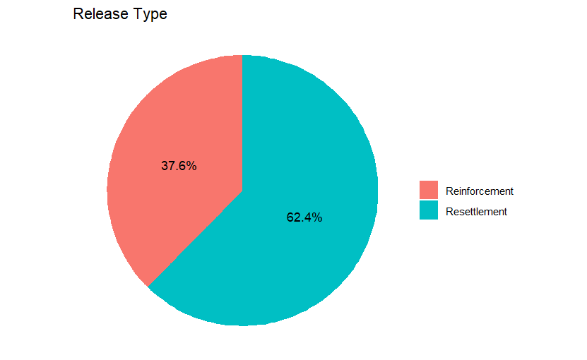

# Wildlife Launch Prediction Model

### 1. **Problem Definition (Hypothesis)**:
The goal of this project is to create a model that predicts the next animal release type—whether it will be **Reinforcement** or **Resettlement**. We will base the prediction on three factors: **animal type**, **site evaluation**, and **season** (based on the release date). We focus on animal types that have been released more than 5 times to ensure the model has enough data to make accurate predictions.

### 2. **Data Gathering and Preparation**:
We used data from the **National Center for Wildlife Development's open data portal** ([https://www.ncw.gov.sa/open-data](https://www.ncw.gov.sa/open-data)), specifically the **wildlife-launch-and-resettlement-dataset**. We cleaned the data by removing any missing values and focused only on animal types with more than 5 releases. This ensures that our model is trained with sufficient data.

### 3. **Descriptive Analysis**:
We analyzed the frequency of releases for each animal type. By looking at the number of releases, we identified which species had more than 5 releases and focused on those. We also examined how **season** and **site evaluation** influenced the release type (Reinforcement or Resettlement).

### 4. **Investigating Attribute Relationships**:
We looked at how the **animal type**, **site evaluation**, and **season** are related to whether the release is a **Reinforcement** or **Resettlement**. This helped us understand which factors play a role in deciding the release type.

### 5. **Creating Charts**:
We created several charts to visualize the data:
- **Bar charts** to show how many times each animal type was released.
- **Pie charts** to show the distribution of **Reinforcement** vs. **Resettlement**.
- **Seasonal charts** to see if the release type changes by season.

### 6. **Building the Predictive Model and Evaluating Performance**:
We used a **logistic regression** model to predict whether the next release will be **Reinforcement** or **Resettlement**, based on the animal type, site evaluation, and season. After training the model, we evaluated its performance and found that it correctly predicted the release type **74.07%** of the time.

---

In summary, by focusing on animal types with more than 5 releases from the **wildlife-launch-and-resettlement-dataset**, we built a model that predicts the next release type with an accuracy of **74.07%**. This model can help wildlife managers make better decisions about future animal releases.
