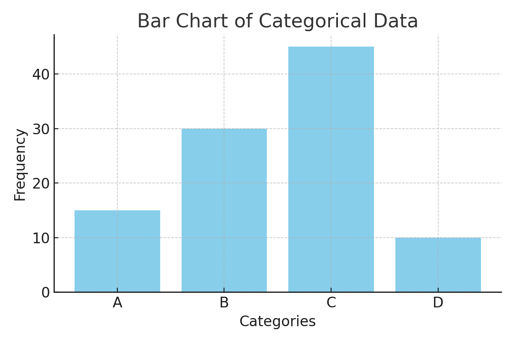
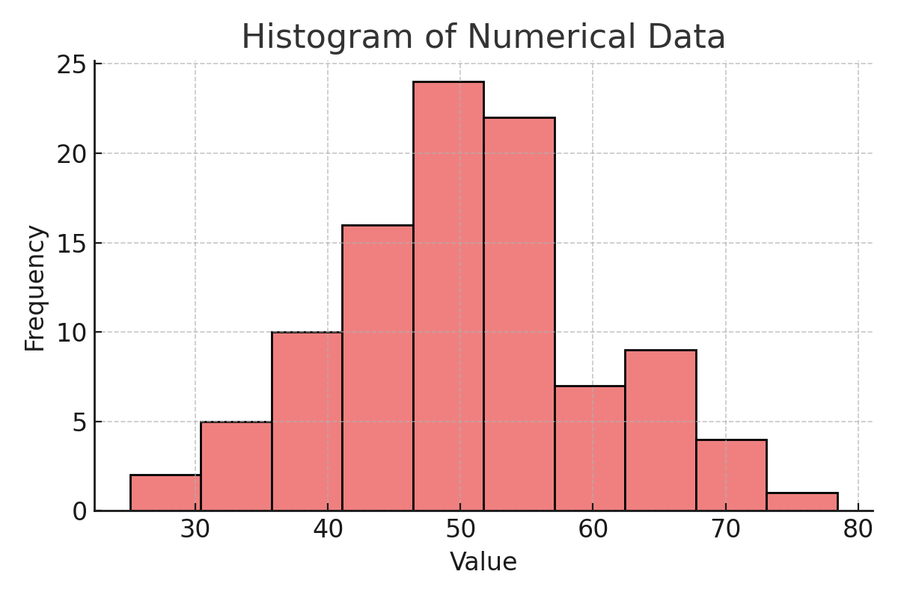
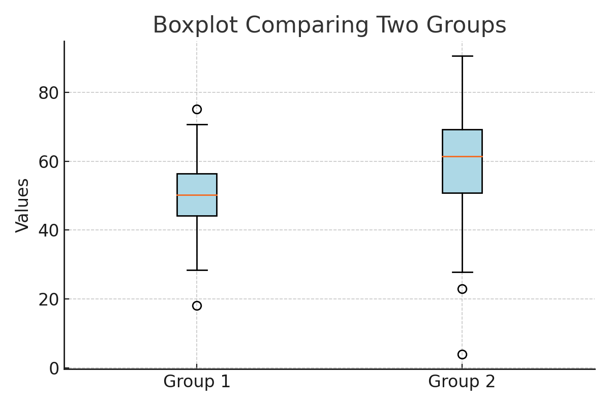
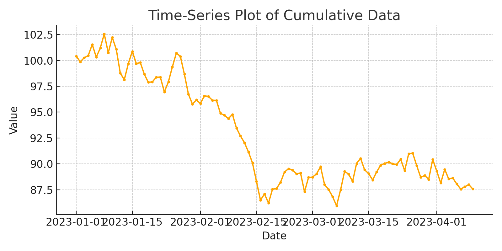

# **Chapter 3: Graphical Methods for Describing Data**

---

### **Summary:**
This chapter focuses on how to visually represent and summarize data using various graphical methods. These methods help identify patterns, trends, and distributions in both categorical and numerical data.

---

### **Key Topics:**

#### **1. Graphical Methods for Categorical Data**
- **Bar Charts:**
  - Displays frequencies or relative frequencies for categories.
  - Bars are separated to indicate that data is categorical.
  - Example: Favorite colors among a group of people.

- **Pie Charts:**
  - A circular graph divided into slices, where each slice represents a category's proportion.
  - Useful for showing relative frequencies.
  - Example: Market share of different companies.

---

#### **2. Graphical Methods for Numerical Data**
- **Histograms:**
  - Used to represent the distribution of numerical data.
  - Data is divided into intervals (bins), and the height of each bar represents the frequency within that interval.
  - Useful for identifying skewness, symmetry, and modality.

- **Dot Plots:**
  - Displays individual data points along a number line.
  - Simple and effective for small datasets.

- **Stem-and-Leaf Displays:**
  - Splits data into a “stem” (leading digits) and “leaf” (trailing digits).
  - Retains the original data values while displaying distribution.

- **Boxplots (Box-and-Whisker Plots):**
  - Summarizes the five-number summary: minimum, Q1, median, Q3, maximum.
  - Useful for identifying outliers and comparing distributions.

---

#### **3. Exploring the Shape of a Distribution**
- **Symmetry:**
  - A distribution is symmetric if the left and right sides are mirror images.

- **Skewness:**
  - Right-skewed (positively skewed): Tail is longer on the right.
  - Left-skewed (negatively skewed): Tail is longer on the left.

- **Modality:**
  - Unimodal: One peak.
  - Bimodal: Two peaks.
  - Multimodal: Multiple peaks.

---

#### **4. Comparing Two or More Distributions**
- **Side-by-Side Boxplots:**
  - Used to compare the distributions of a numerical variable across different categories.
  - Example: Test scores across different classes.

- **Back-to-Back Stem-and-Leaf Displays:**
  - Compares two datasets on either side of a shared stem.

---

#### **5. Time-Series Plots**
- Visualizes data points over time.
- Useful for identifying trends, cycles, and seasonal effects.
- Example: Monthly sales data over several years.

---

#### **6. Misleading Graphs**
- Common issues to watch for:
  - Misleading scales (e.g., starting a bar chart axis at a nonzero value).
  - Overemphasizing differences.
  - Using inappropriate graph types.

---

### **Key Takeaways:**
- Graphical representations make it easier to understand data distributions and relationships.
- Choosing the right graph depends on the type of data (categorical vs. numerical) and the goal of the analysis.
- Always ensure graphs are clear, accurate, and not misleading.

---

### **Graphs:**

#### **1. Bar Chart**
This bar chart shows the frequency of categorical data across four categories (A, B, C, D):

#### **2. Histogram**
This histogram illustrates the distribution of numerical data:

#### **3. Boxplot 
 Compares two groups' distributions:
 
 

 #### **4. Time-Series Plot
 Visualizes cumulative data over time.
 
  

---
